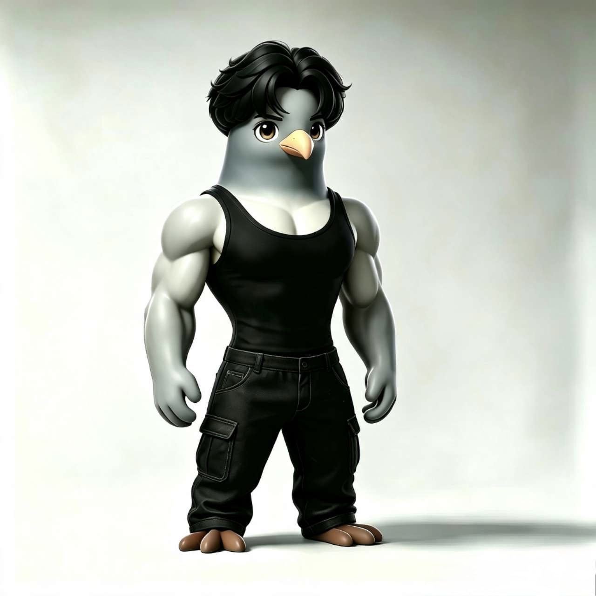
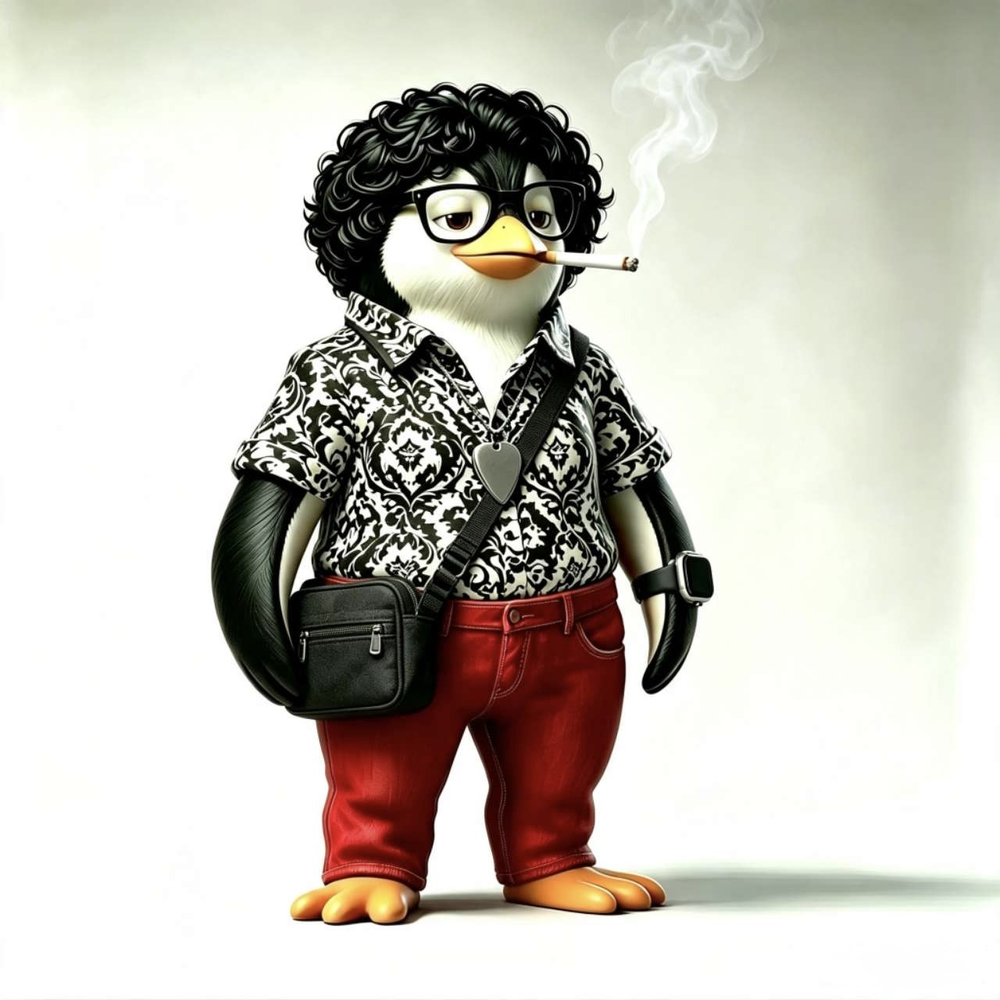
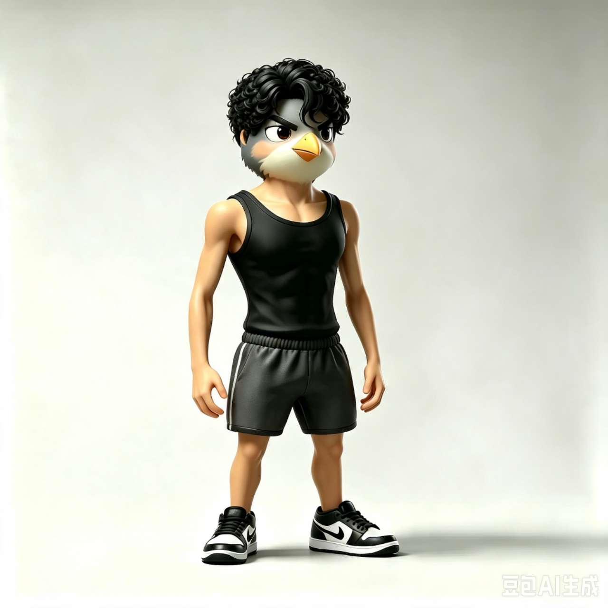
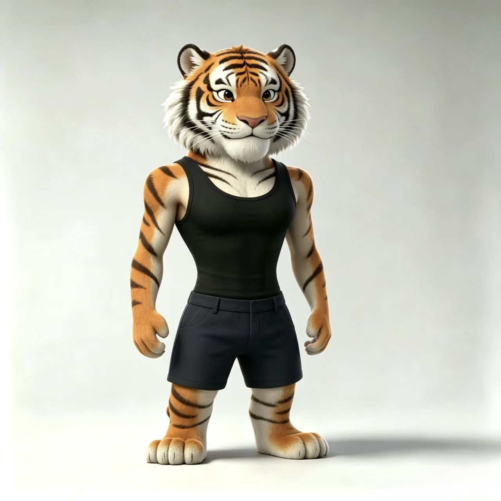
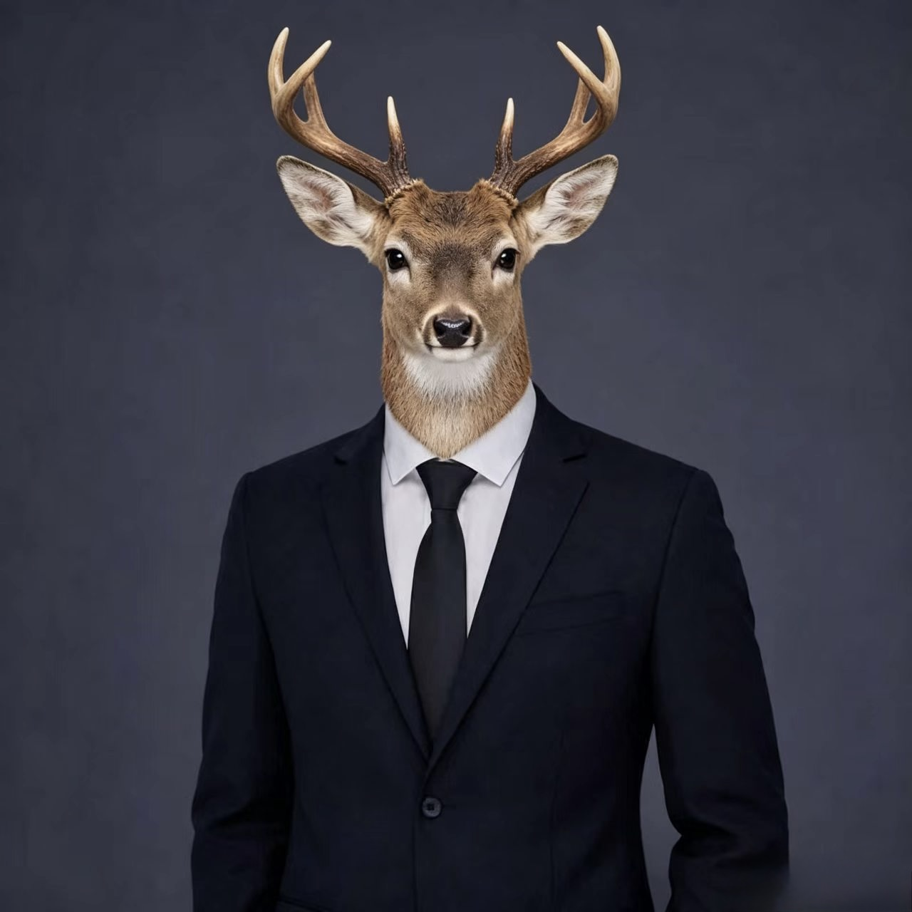
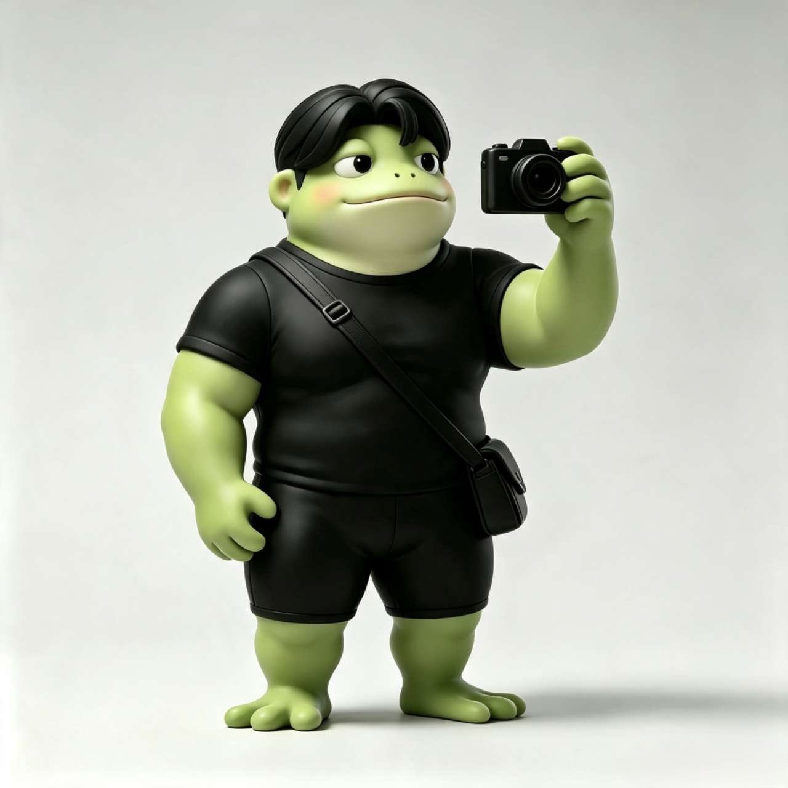
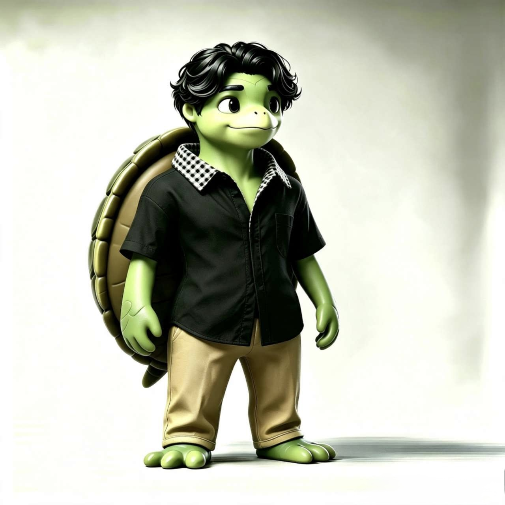
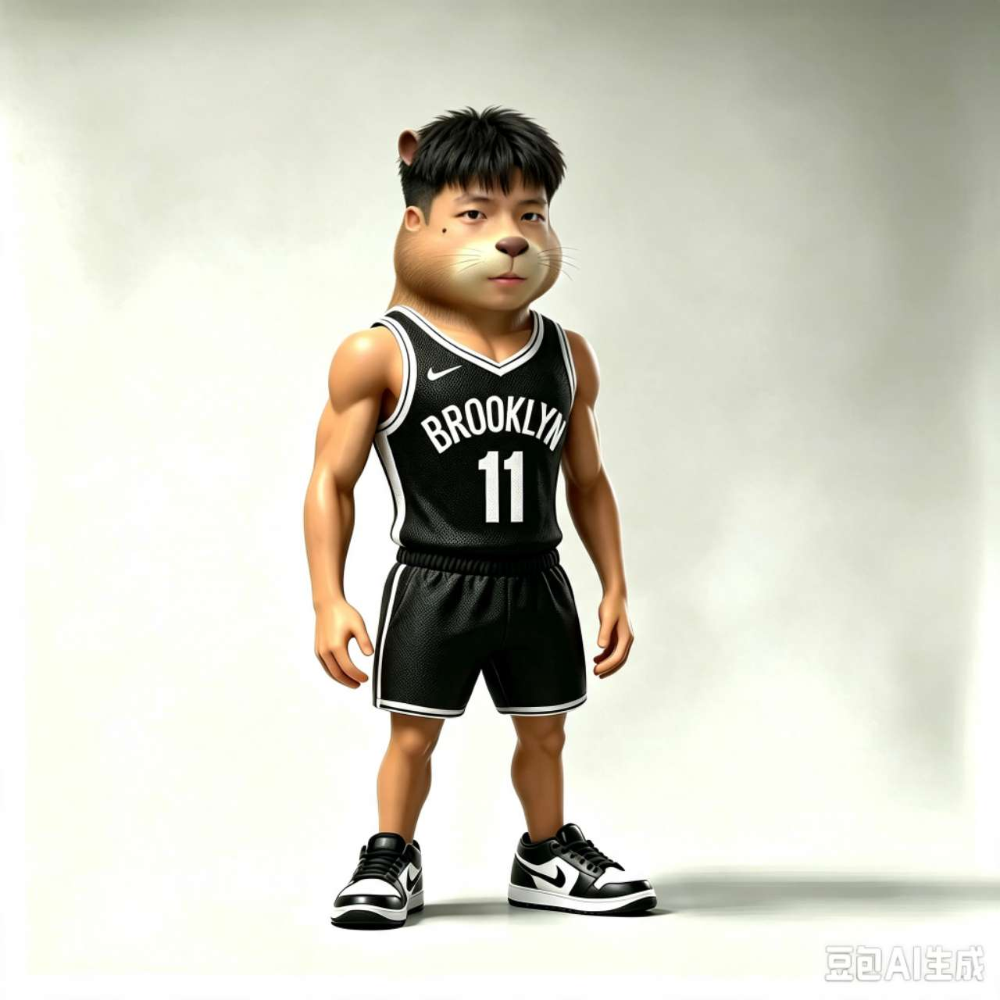

# 鹿图DeerPhotos

用熟悉的角色形象，把朋友之间的聚餐、旅行和日常片段生成 AI 生活照片。

鹿图将每位成员的本名、昵称和参考形象绑定到同一个身份，再根据你的描述安排出场人物、动作和场景。照片可以有手机抓拍的光线与氛围，同时保留鸽子、企鹅、鹿、水豚等角色原有的外观。

**随包收录 9 位成员、59 个别名和 9 张已绑定的角色参考图。** 本项目是供 Agent 读取的技能与素材包，生成图片需要运行环境提供生图工具。

[快速开始](#快速开始) · [角色参考](#角色参考) · [指令示例](#指令示例) · [维护人物档案](#维护人物档案) · [验证与限制](#验证与限制)

## 快速开始

准备能读取本地技能文件、查看图片并调用生图工具的 Agent 环境。技能默认优先使用内置 `image_gen`；未固定底层模型版本，也未包含独立的生图客户端或 API 调用脚本。

### 按路径使用

保留完整的 `deerphotos` 文件夹，将其中的 [SKILL.md](SKILL.md) 附给 Agent，或在请求中提供它的实际路径，并让 Agent 读取相邻的档案和素材。只复制 `SKILL.md` 会缺失人物映射和参考图。

例如，把技能文件附到对话后说：

> 使用鹿图DeerPhotos，生成毛毛、企鹅和困困凌晨在路边摊吃面的照片。三个人都入镜，像朋友用手机随手拍的，保留各自形象。

### 放入技能目录

在使用本地 Codex 技能目录的环境中，将整个 `deerphotos` 文件夹复制到 `$CODEX_HOME/skills/`；未设置 `CODEX_HOME` 时，使用 `~/.codex/skills/`。目标结构应为 `skills/deerphotos/SKILL.md`，并保留同级的 `agents/`、`references/` 和 `assets/`。

确认当前会话已识别该技能后，使用调用标识：

```text
$deerphotos 毛毛、企鹅和困困凌晨在路边摊吃面，手机抓拍感，横向构图。
```

显示名称为“鹿图DeerPhotos”，调用标识为 `$deerphotos`。将文件放入目录不代表当前会话已经加载；若尚未识别，可先按路径使用。

## 角色参考

下图是用户提供并随技能保存的原始角色参考，供身份绑定使用；它们不是鹿图执行后生成的场景样片。

<table>
  <tr>
    <td align="center"><br><strong>李彦臻</strong><br><sub>灰色鸽子 · 中分发 · 健壮体型</sub></td>
    <td align="center"><br><strong>罗宇伦</strong><br><sub>黑白企鹅 · 卷发 · 黑框眼镜</sub></td>
    <td align="center"><br><strong>彭鹏</strong><br><sub>灰白鸟头 · 短卷发 · 精瘦体型</sub></td>
  </tr>
  <tr>
    <td align="center"><br><strong>唐博釜</strong><br><sub>橙黑条纹虎 · 白色口鼻毛</sub></td>
    <td align="center"><br><strong>唐胤鑫</strong><br><sub>垂耳犬 · 黑框眼镜 · 敦实体型</sub></td>
    <td align="center"><br><strong>涂腾辉</strong><br><sub>写实鹿头 · 分叉鹿角 · 西装</sub></td>
  </tr>
  <tr>
    <td align="center"><br><strong>魏子奇</strong><br><sub>浅绿青蛙 · 中分发 · 敦实体型</sub></td>
    <td align="center"><br><strong>夏炜城</strong><br><sub>绿色乌龟 · 卷发 · 分块龟壳</sub></td>
    <td align="center"><br><strong>詹绍源</strong><br><sub>人脸与水豚混合 · 短碎发 · 篮球服</sub></td>
  </tr>
</table>

外观以原图为依据。服装、姿势和地点可按场景调整；鹿角、龟壳、脸型、物种和体型等识别特征应保持。相机、平板、香烟等道具不要求每次出现，原图的平台水印也不作为角色特征带入新画面。

### 本名与别名

| 本名 | 已收录别名 |
| --- | --- |
| 李彦臻 | 吉吉毛毛、毛毛、李彦毛、臻哥、蒸鸽、蒸哥 |
| 罗宇伦 | 企鹅、扑克、朴客、撸一撸、录一录、罗鸡巴 |
| 彭鹏 | 彭鸟、鸟鸟、鸟鸡巴、鸟别 |
| 唐博釜 | 唐伯虎、唐白虎、虎鸡巴、虎先锋 |
| 唐胤鑫 | 狗鸡巴、唐狗、tango、帅狗、狗别 |
| 涂腾辉 | 涂涂、鹿、鹿腾辉、兔爷、兔兔、涂爷、涂鸡巴、鹿鸡巴、涂别 |
| 魏子奇 | 魏鸡巴、拍别、魏别、维基吧、重庆别、拍鸡巴、青蛙、蛙别、鹿子奇、五子棋 |
| 夏炜城 | 龟龟、龟鸡巴、龟炜城、夏别、龟别、龟头 |
| 詹绍源 | 鹿绍源、困困、水豚、困别、詹鸡巴、战绩吧、詹味、展位、水豚噜噜 |

完整、可维护的对应关系见 [人物档案](references/characters.json)。不同昵称不会产生新角色；昵称中的字面含义也不会自动变成画面内容。

## 指令示例

可以直接说生活场景，无需填写固定提示词模板。以下展示技能规定的解析方式，实际出图仍需核对人物、人数和动作。

| 你可以这样说 | 技能应如何理解 |
| --- | --- |
| 毛毛、臻哥还有企鹅去吃宵夜 | 李彦臻、罗宇伦，共两位 |
| 鹿子奇、鹿绍源和鹿去露营 | 魏子奇、詹绍源、涂腾辉，共三位 |
| 青蛙和企鹅下五子棋 | 两位成员下棋，不增加第三个角色 |
| 全员吃火锅，除了狗别 | 九人名单中排除唐胤鑫，共八位 |
| 鸟鸟给龟龟拍一张 | 夏炜城入镜，彭鹏为拍摄者 |
| 不是企鹅，是鸟别，其他不变 | 替换为彭鹏，保留其余条件 |
| 还是刚才那三个人，换成海边 | 沿用已确认的名单，修改场景 |

“展位”“扑克”“录一录”“五子棋”等词既可能是昵称，也可能是普通词语。例如“在展位打扑克，录一录视频”不应仅因命中词语就添加成员；“叫上展位、录一录和五子棋”则提供了召集人物的语境。发生影响出场名单的歧义时，技能要求先澄清。

也可以接着上一张继续修改：

> 把鸟别也加进来，其他人的外观、位置和光线保持一致。

> 这次换成雨天的民宿客厅，兔爷坐中间，大家穿便服，不加名字。

更多表达及边界见 [指令变体与示例](references/instruction-variants.md)。用户的“我”和没有前文的“他们”不会被自动指定为某位成员。

## 输出与生图边界

技能要求默认生成一张自然生活风格的照片，完成后检查出场人数、身份区分、动作归属和排除项。出现漏人、串角色等问题时进行针对性修正；连续两次修正仍未解决，应说明具体偏差并交付当前最佳结果。

输出包含最终图片及简短场景记录：原始请求、出场人物、本次参考文件、最终提示词、版本、生成日期和 AI 生成来源。指定保存目录时使用该目录；未指定时遵循当前工具与工作区的保存约定。修改采用新版本，保留原图。

**内置生图工具不可用时，技能要求说明情况并提供提示词及参考图清单，不将提示词当作已经生成的照片。** 技能不会自行切换到付费 API 或要求用户提供密钥。

人物档案和原始参考图保存在技能目录中；生图时，场景提示词与所选参考图会作为输入交给当前环境的生图工具。鹿图没有定义服务端保存期限、独立计费或使用额度，这些取决于实际使用的工具与账户；本地保存素材不代表本地推理。

## 维护人物档案

[characters.json](references/characters.json) 是本名、别名和形象对应关系的统一来源：

- **新增昵称：**明确说明“以后也叫某人某昵称”，更新对应人物的 `aliases`，检查是否与其他人的称呼冲突。
- **新增人物：**提供本名、别名及明确对应的参考图，建立稳定 `id`，将图片保存到 `assets/characters/` 下的对应人物目录。
- **更新形象：**说明这次是临时造型还是长期默认；补充参考图路径、来源、映射依据、可见特征及文件校验值。
- **单次换装：**直接描述服装与场景，不覆盖长期人物身份档案。

素材路径相对于技能根目录记录，移动时应携带整个文件夹。档案的 `source` 字段保留原始素材来源位置，实际随包图片由 `path` 字段引用。

## 文件结构

```text
deerphotos/
├── README.md
├── SKILL.md
├── agents/
│   └── openai.yaml
├── assets/
│   └── characters/          # 九位成员的原始参考图
├── references/
│   ├── characters.json     # 身份、别名、外观与图片映射
│   └── instruction-variants.md
└── docs/
    ├── readme-evidence.json
    └── verification.json
```

## 验证与限制

2026-09-24 的本地静态检查确认：人物数为 9、别名数为 59，本名与别名没有跨人物重复，九张参考图均存在且 SHA-256 与档案一致。具体范围见 [静态检查记录](docs/verification.json)，README 的重要声明对应关系见 [文档证据记录](docs/readme-evidence.json)。

尚未进行实际场景生图评估，也未验证全员群像的一致性。别名消歧与多轮修改目前是技能中规定的行为，不是确定性解析器或已通过的效果评测。参考图可以为生成提供身份依据，但不保证每次人数、细节或相似度完全正确。

涂腾辉的参考是较写实的半身鹿头形象，其他角色多为立体卡通全身形象。混合场景需要协调光线与透视；未在原图出现的下半身细节不能当作已确认的固定设定。所有生成场景都是 AI 演绎，不作为真实事件的实拍记录。

## 许可

本目录尚未提供项目级许可证，也未提供人物参考素材的再分发授权说明。使用 READMEWriter 编写本文档不意味着鹿图采用 READMEWriter 自身的 GPL 许可证。
